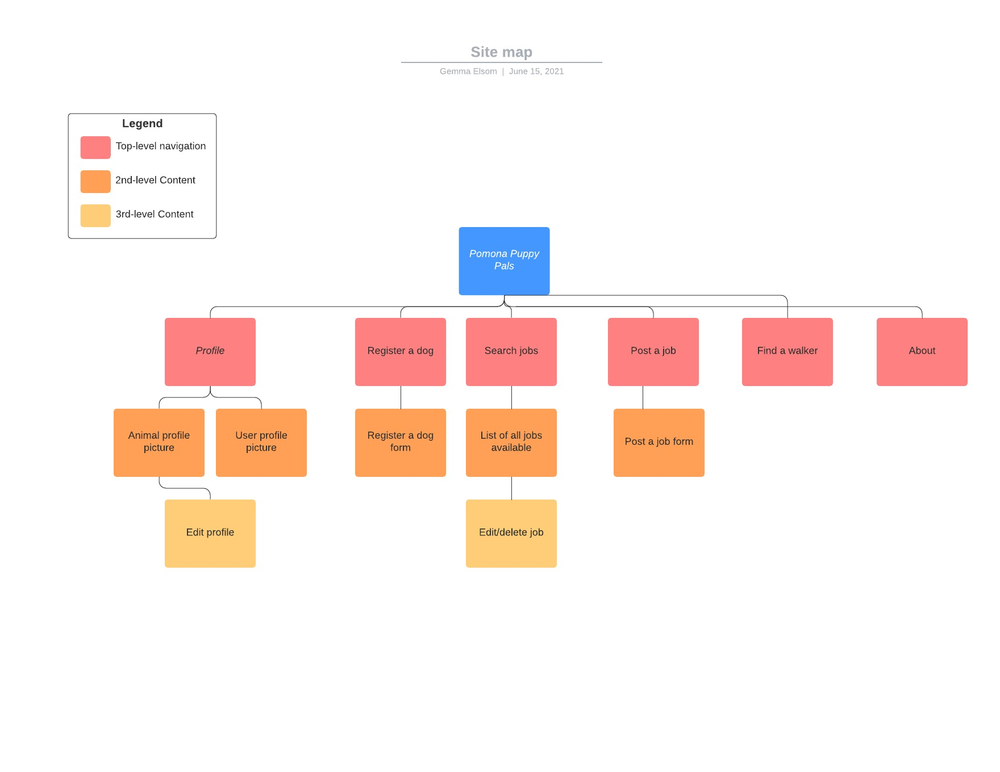
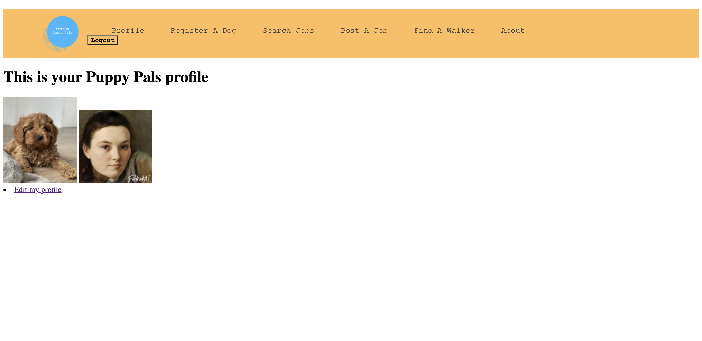
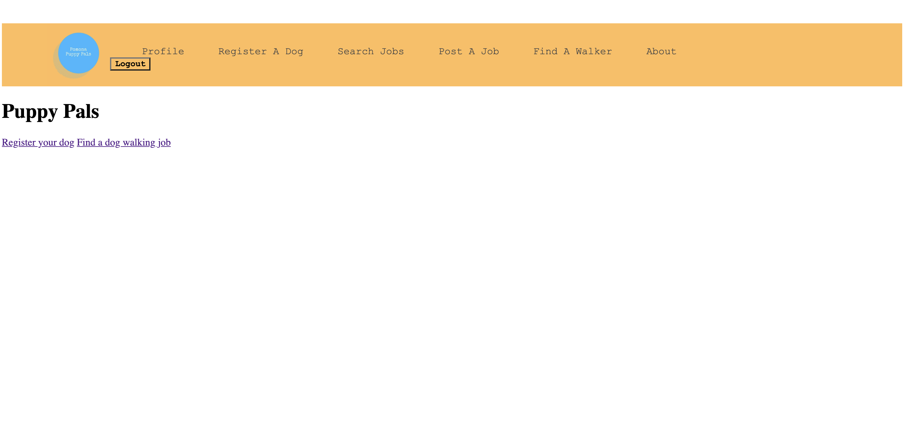
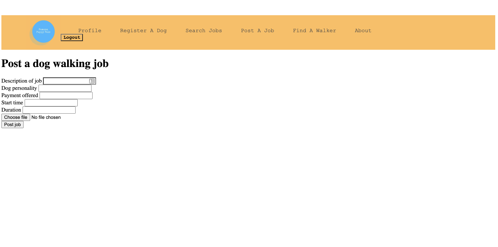
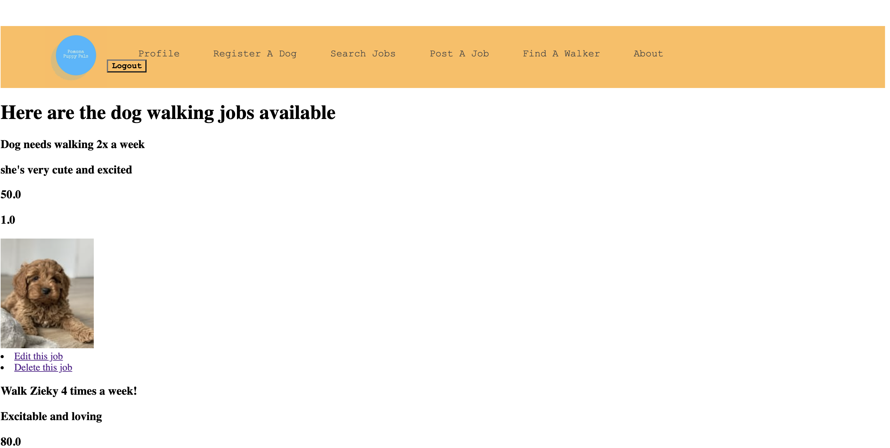
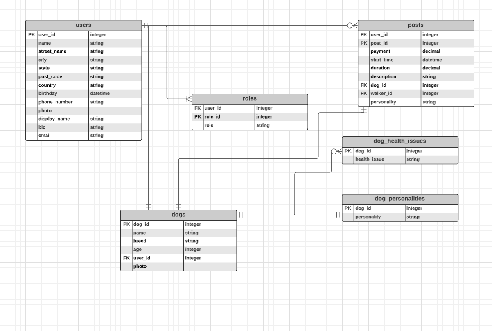
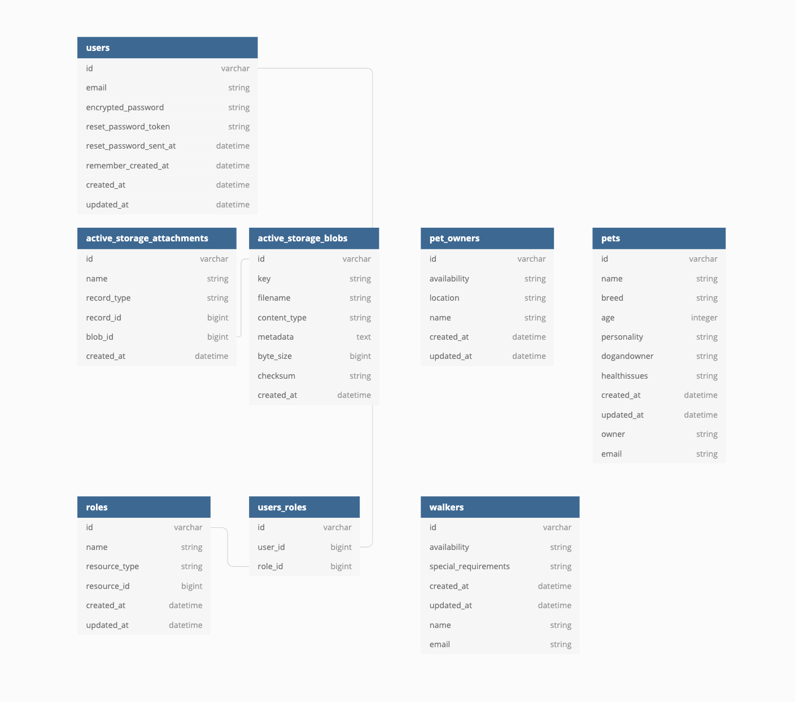

# READ ME

Puppy Pals has been built to make it easier to find dog walkers in your local area, or to find dog walking jobs in your area. This is a free and easy to use service that allows users to post jobs, and find the perfect match that works for them. The problem with dog walking sites that are on the market now, is that they are paid services, and there's quite a bit of competition to try and find work. Puppy Pals offers stress-free arrangements where payments are handled privately directly from the dog owner to the walker, and the users do not have to pay any hidden fees.

Here is the link to my deployed application: https://agile-ocean-58900.herokuapp.com/

Here is the link to the GitHub repo: https://github.com/gemmaelsom/pomona_puppy_pals

Here is the link to the Trello board I used. The user stories are here too. https://trello.com/b/mh9Oqnj4/puppypals-redo

The purpose of Puppy Pals is to provide a quick and easy opportunity to either find a dog walker to look after your pet, or to find work as a dog walker. I wanted to build an application that empowers users to contact each other, and organize their own rate and payment method. 

## Functionality / features
Uses are first prompted to make an account. Upon making their account, they will upload a profile picture, and create a display name. Once they are logged in, they can create a profile for their dog. When creating this profile, they will provide the dogs name, breed and age, and upload an image of the pet. Users can then go to the "Post a job" page to post an ad for a dog walking job. When creating a post for a dog walking job, users will need to provide a description of the job, a brief description of the dogs' personality, the payment they are offering, their preferred start time of the job, and the duration of the walk required. This information is posted on the "search jobs" page for other users to peruse and find a match. 

## Sitemap

## Screenshots

## Target audience

Any one can use this app from the ages of 18+. The reason it's 18+ is to ensure that children are not signing up and meeting people off the internet. The target audience needs to have a level of maturity to use the app, so that they are using it safely. 

## Tech stack (e.g. html, css, deployment platform, etc)

This is the tech stack I used to develop this app:

HTML - I used HTML to develop the views of the application
CSS - I didn't use a lot of CSS, but I did use it to create the nav bar 
Ruby on Rails - This application was built using the Ruby on Rails framework
Devise - I used Devise for authentication, which allows users to create personal accounts on the website
Pundit - I used Pundit for authorization, so that only users with the admin role can edit or delete job postings
Heroku - I used Heroku to deploy the application
PostgresQL - The database for the application is PostgresQL.

#	Wireframes for your app

# An ERD for your app
This is the ERD for my application:

# Explain the different high-level components (abstractions) in your app

User
The user model is used to store the data about the website's users. In order to create an account with Pomona Puppy Pals, users must provide their email address, first name, last name, country, postcode, street name, city, state, birthday day, contact number, display name and a bio. This information is stored in the SQL database. 

Dog
The dog model stores all of the data about the different dogs that have been registered through the website. The information stored about the dogs is name, age and breed. The dog that a user registers will be automatically connected to their account and profile.

Dog Personalities and Dog Health Issues
These two models are in place so that we have a record of any health issues that the dogs on file may have, in case something happens on one of the walks. We ask for the personality and health issues so that walkers can be aware of any potential issues before they sign up for a job that they were not prepared for.

In terms of third party services that I used, I used Heroku to deploy this application, which is a cloud platform that allows developers to deploy, manage, scale modern applications. 

#	Describe your projects models in terms of the relationships (active record associations) they have with each other

In terms of Active Record Associations in the projects models, the User model has a "has_many" relationship with the Roles table, as a user can have multiple roles. They may be an admin, a walker and a dog owner all at once. The User model also has a "has_many" relationship with the Post model, as a user can post as many job listings as they'd like. The User model has a "has_one" relationship with the Dog model though, as a User can only enlist one dog per account. The Dog model has a "belongs_to" relationship with the User model, as the two id's need to be constantly linked to each other. The Dog model has a "Has_one" relationship with Post, and Dog personality, and a "has_many" relationship with Dog health issues. 

The Post model has a "belongs_to" relationship with both the Dog model, and the User model. This ensures that that all three are linked at all times. 

#	Discuss the database relations to be implemented in your application

I used PostgresQL to host the database for this application. There are three main relationships in database relations, although this database only uses two of them. Dogs and Users have a one to one relationship. The attributes in both tables have a unique relationship with each other. The Dogs and Posts tables also have a one to one relationship. A job post can only be for one dog, and a dog id can only be associated with one Post, and vise versa. The only one to many relationships in this application, are between the User table, and Role and Post. 

Dog Health Issues has a one to many relationship to the Dog table, but Dog Personality has a one to one relationship with it. 

The primary key for each table is the associated "id", for example there is the "user_id", "dog_id", "role_id", post_id". The user_id the foreign key for the Post, Role, and Dog tables. The dog_id is the primary key for both Dog Health Issues and Dog Personality.

This is the database schema design:

#	Describe the way tasks are allocated and tracked in your project

I used Trello to track the tasks that were required for this project. I used Trello to create a Kanban board as per the Agile project management methodology. I had five columns on the board - User stories, To Do, In Progress, Completed, and Submission To Do. I started with the User stories, and numbered them as I went so that I had a clear idea of how much work may be involved. I filled out the To Do column with everything I knew absolutely had to be done for the application to be built. When I was working on a particular task, I would move it over to the In Progress board, and then once completed I'd move it to the Completed column. At the end of each working day, I would go through my To Do column and check that I have not missed anything, and that all tasks are in the correct column. Throughout the day I would often add more tasks to the To Do column. 